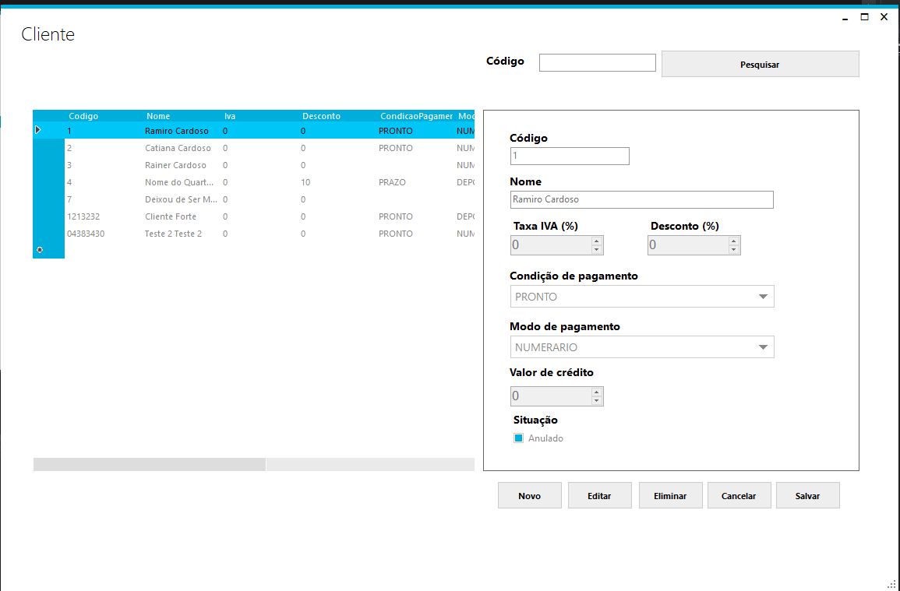
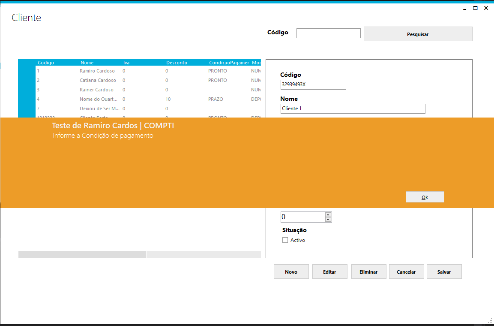
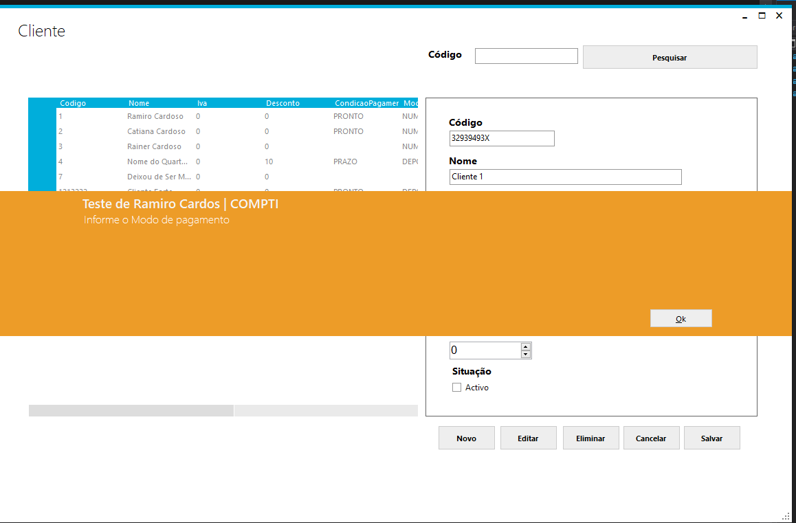
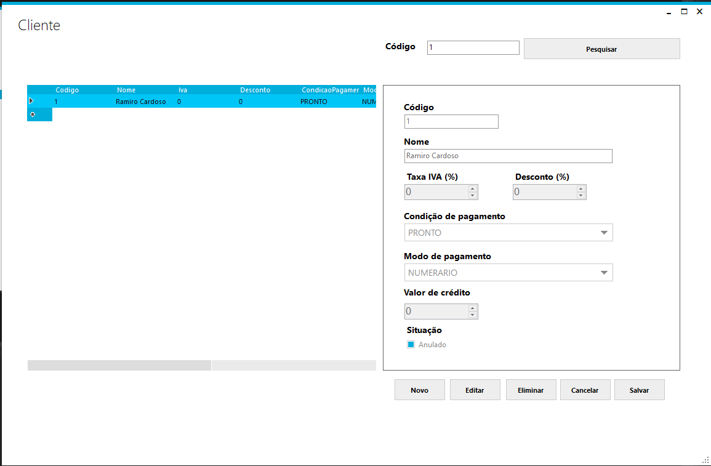
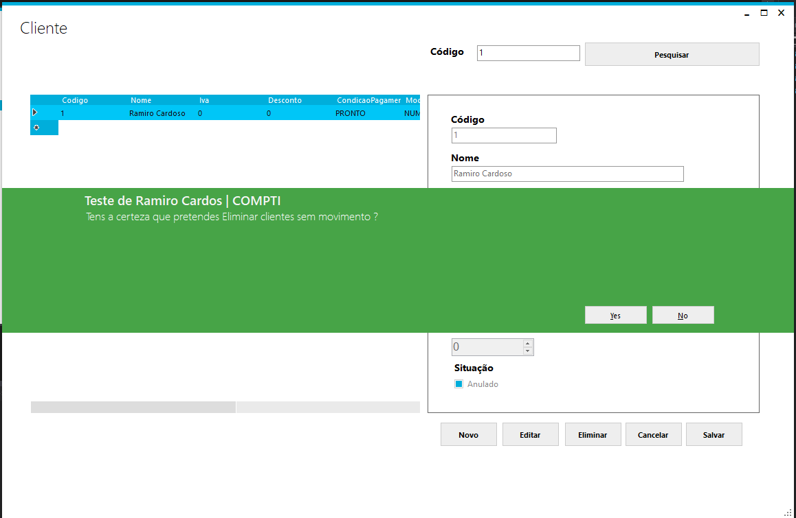

# Nome do Projecto
<h1 align="center" >Teste de Ramiro Cardoso | COMPTI</h1>

## Descriçao do Projecto

 Projecto para gestão de clientes 

Tabela de conteúdos

 <a href="#objetivo">Status do projecto</a> •
 <a href="#roadmap">Arquitetura</a> • 
 <a href="#tecnologias">Features</a> • 
 <a href="#contribuicao">Demostração da aplicação</a> • 
 <a href="#licenc-a">Pré-requisitos</a> • 
 <a href="#autor">Autor</a> • 
 <a href="#licenc-a">Licença</a> • 

##Status do Projecto
<h4 align="center"> 
	🚧 🚀 Concluido  🚧
</h4>

## Arquitetura
O Projecto foi Desenlvolvido com uma camada no principio, tudo na UIWF
lançada a versao 0.0.1 estavel com todas as funcionalidades,
surgiu a necessidade de evoluir para uma arquitetura mais robusta 
devido a manutencao, tempo de vida útil, numero de devs(melhor compreensao),
divisao de responsabilidade, organizacao do codigo, e, dentre
outros criterios.

o projecto Final tem 3 camadas:
UIWF - é a camada com a interface do usuario feita em WinForm
Core - é a camada com lib e componentes comuns entre todo o projecto
DataAcess - contem a forma de como o App vai conectar-se com dados, seja eles um
banco de dados relacional, não relacional, uma folha de Texto, um arquivo Excel que é 
o caso do projecto em causa.
Service - é a camada que contem todas as regras de negocio do App

### Features

- [x] criar novo cliente
- [x] condicao de pagamento e modo de pagamento obrigatorio na criacao e atualizacao do cliente
- [x] pesquisar cliente pelo codigo
- [x] atualizar dados do cliente
- [x] anular clientes sem movimento ( isto é, valorCredito = 0 )
- [x] nao permiti a eliminacao de clientes com movimentos (isto é, valorCredito != 0)
- [x] criar novo cliente
- [x] mudar o estado da faturacao segundo os criterios:
    minimo = 100,00;
    maximo = 10 000,00
     se valorCredito < minimo; "FRACO"
     se valorCredito >= minimo E valorCredito <= maximo; "MODERADO"
     se valorCredito > maximo; "FORTE"
## Extra
- [x] não repetir mesmo código do cliente

## Demonstração da aplicação

<h1 align="center">
  
  
  
  
  
</h1>

### Pré-requisitos
Para rodar o projecto em modo de desenvolvimento é necessario ter o Visual Studio 2013 ou acima com .Net Framework 4.5

Para acessar o build é necessario ter instalado na sua máquina o .Net Framework 4.5

# Clone este repositório
$ git clone https://github.com/oosodrac/compti-teste.git

$ abra o arquivo TesteCompti.sln no VS
$ vai até a camada DataAcess
$ abra a class ExcelHelper
$ crie um ficheiro .xlsx no seu computador
$ alter o caminho da variavel sourceFile com o directorio do seu arquivo .xlsx
$ aperte em F5 no VS e Teste o App.

### 🛠 Tecnologias
As seguintes ferramentas foram usadas na construção do projeto:
- [https://visualstudio.microsoft.com/vs/older-downloads/] VS2013
- [https://www.nuget.org/packages/ExcelMapper/5.0.118] ExcellMapper
- [https://www.nuget.org/packages/MetroModernUI] MetroFramework

## Autor

Ramiro Cardoso | 931 926 426 | ramiro.cardoso@protonmail.com

## Licença

MIT License

Copyright (c) <2022> <Ramiro Cardoso>

Permission is hereby granted, free of charge, to any person obtaining a copy
of this software and associated documentation files (the "Software"), to deal
in the Software without restriction, including without limitation the rights
to use, copy, modify, merge, publish, distribute, sublicense, and/or sell
copies of the Software, and to permit persons to whom the Software is
furnished to do so, subject to the following conditions:

The above copyright notice and this permission notice shall be included in all
copies or substantial portions of the Software.

THE SOFTWARE IS PROVIDED "AS IS", WITHOUT WARRANTY OF ANY KIND, EXPRESS OR
IMPLIED, INCLUDING BUT NOT LIMITED TO THE WARRANTIES OF MERCHANTABILITY,
FITNESS FOR A PARTICULAR PURPOSE AND NONINFRINGEMENT. IN NO EVENT SHALL THE
AUTHORS OR COPYRIGHT HOLDERS BE LIABLE FOR ANY CLAIM, DAMAGES OR OTHER
LIABILITY, WHETHER IN AN ACTION OF CONTRACT, TORT OR OTHERWISE, ARISING FROM,
OUT OF OR IN CONNECTION WITH THE SOFTWARE OR THE USE OR OTHER DEALINGS IN THE
SOFTWARE.